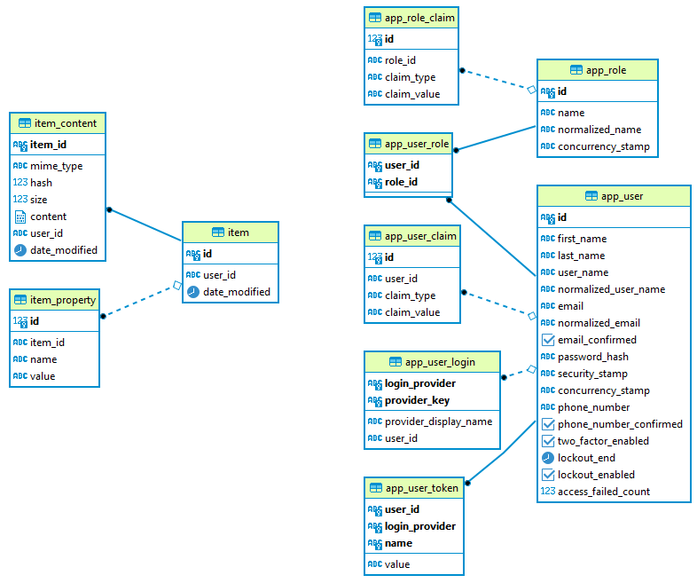

# Simple BLOB Store

- [Simple BLOB Store](#simple-blob-store)
  - [Docker](#docker)
  - [Quick Start](#quick-start)
  - [Database Schema](#database-schema)
  - [API](#api)
    - [Account](#account)
    - [Auth](#auth)
    - [Item](#item)
    - [ItemContent](#itemcontent)
    - [ItemProperty](#itemproperty)
    - [User](#user)
  - [CLI Tool](#cli-tool)
    - [List Command](#list-command)
    - [GetInfo Command](#getinfo-command)
    - [Delete Command](#delete-command)
    - [Upload Command](#upload-command)
    - [Download Command](#download-command)
    - [Add Properties Command](#add-properties-command)
    - [List Users Command](#list-users-command)
    - [Add User Command](#add-user-command)
    - [Delete User Command](#delete-user-command)
    - [Add User Roles Command](#add-user-roles-command)
    - [Delete User Roles Command](#delete-user-roles-command)
    - [Update User Command](#update-user-command)
  - [History](#history)
    - [2.0.1](#201)
    - [2.0.0](#200)

A very simple BLOB store with minimal dependencies. This is used internally, as a support subsystem for other projects, but can eventually be used as a standalone utility service.

Currently the only implemented RDBMS is PostgreSQL, but others may follow.

Projects:

- `SimpleBlob.Core`: core components.
- `SimpleBlob.Sql`: shared components for SQL-based implementations.
- `SimpleBlob.PgSql`: PostgresSQL implementation.
- `SimpleBlob.Api.Models`: models used by API.
- `SimpleBlobApi`: API wrapper.
- `blob`: CLI client.

## Docker

Quick Docker image build:

```bash
docker build . -t vedph2020/simple-blob-api:2.0.2 -t vedph2020/simple-blob-api:latest
```

(replace with the current version).

## Quick Start

1. download `docker-compose.yml` in some folder.

2. create a folder `var/db/pgsql` in the host to hold the database files. If you desire, you can change the path in the script.

3. run it with `docker-compose up` (prefix `sudo` for Linux/MacOS).

You can use the CLI client from project `blob`. This is for Windows, Linux, or MacOS.

If you want to test the functions, use the batch in `demo.zip`. In this case:

1. unzip the full archive with its files and folders in some folder, e.g. `blob`. For Windows you will run `demo.bat`, for Linux `demo.sh`. For MacOS, it's easier to rename `demo.sh` in `demo.command`. Also, for non-Windows OSes ensure that you have execution rights on this file (e.g. `chmod 777 ./demo.sh`).

2. place the CLI binaries under a `cli` subfolder in the `blob` folder (or whatever you named it). Here too, ensure that for non-Windows OSes you have execution rights on the `blob` file.

3. ensure that the BLOB service is running (see above for `docker-compose.yml`).

4. run the batch. This will tour you along the main functions provided by the CLI, step by step.

When you deploy the API to some server, you must change the base API URI in the `appsettings.json` file of the CLI client application, so that it reflects the server location. Also, on the server side:

- _ensure you change the default user's API password_, as the default one used in this repository is of course just for the purpose of playing with the system.
- check the CORS allowed locations to eventually add your own.

In both cases, the easiest way to change these settings is setting them (via environment variables) in the Docker compose script.

## Database Schema

In the current implementation, BLOBs are saved in a RDBMS. This fits the usual deployment scenario where your service has easy access to data services, but runs on a limited space host.

The schema is very simple and essentially includes just 3 tables (the auth tables come from the .NET Framework): `item` for each BLOB item metadata; `item_property` for custom metadata; `item_content` for its content.



## API

### Account

`GET /api/accounts/emailexists/{email}`: Check if the specified email address is already registered.

`GET /api/accounts/nameexists/{name}`: Check if the specified user name is already registered.

`POST /api/accounts/register?confirmed=true`: Registers the specified user (here we use `confirmed` to avoid email confirmation).

`GET /api/accounts/resendconfirm/{email}`: Resends the confirmation email.

`GET /api/accounts/confirm`: Confirms the registration.

`POST /api/accounts/changepassword`: Changes the user's password.

`POST /api/accounts/resetpassword/request`: Requests the password reset. This generates an email message to the requester, with a special link to follow to effectively reset his password.

`GET /api/accounts/resetpassword/apply`: Resets the password using the received token.

`DELETE /api/accounts/{name}`: Delete the user with the specified username.

### Auth

`POST /api/auth/login`: Logins the specified user.

`GET /api/auth/logout`: Logs the user out.

### Item

`GET /api/items`: Gets the items matching the specified filter.

`POST /api/items`: Adds or updates the specified item.

`GET /api/items/{id}`: Gets the item with the specified ID.

`DELETE /api/items/{id}`: Deletes the item with the specified ID.

### ItemContent

`POST /api/contents/{id}`: Uploads the BLOB item's content.

`GET /api/contents/{id}`: Downloads the BLOB item's content.

`GET /api/contents/{id}/meta`: Gets the BLOB item's content metadata.

### ItemProperty

`GET /api/properties/{id}`: Gets the properties of the item with the specified ID.

`DELETE /api/properties/{id}`: Deletes all the properties of the BLOB item with the specified ID.

`POST /api/properties/{id}/add`: Adds the specified properties to a BLOB item.

`POST /api/properties/{id}/set`: Sets the specified properties for a BLOB item.

### User

`GET /api/users`: Gets the specified page from the list of registered users. Use page size=0 to get all the users at once.

`PUT /api/users`: Update the specified user data.

`GET /api/users/{name}`: Gets the details about the user with the specified ID.

`GET /api/user-info`: Gets the details about the current user.

`GET /api/users-from-names`: Gets information about all the users whose names are specified.

`POST /api/users/{name}/roles`: Adds the user to the specified roles.

`DELETE /api/users/{name}/roles`: Removes the user from the specified roles.

## CLI Tool

Note: when using `*` in UNIX-based OS (Linux, MacOS) remember to escape it with a backslash (e.g. `\*.xml`).

### List Command

- roles: `admin`, `browser`

This command gets a paged list of BLOB items. Note that for added security a user with reader/writer role but without the `browser` (or `admin`) role cannot get the list of items. This way, he can just retrieve a file if he has its name.

Syntax:

```ps1
./blob list [-n PageNumber] [-z PageSize] [-i IdFilter] [-m MimeType] [-d MinDate:MaxDate] [-s MinSize:MaxSize] [-l LastUser] [-o PropName=PropValue] [-f OutputFilePath] [-u UserName] [-p Password]
```

where:

- `-n` the page number (1-N). Default=1.
- `-z` the page size. Default=20.
- `-i` the BLOB ID filter. You can use wildcards `*` and `?`.
- `-m` the MIME type filter.
- `-d` the dates range filter: each date has format `YYYY-MM-DD`. You can specify the minimum date only (followed by `:`), the maximum date only (preceded by `:`), or both (min`:`max).
- `-s` the size range filter: each size is in bytes. You can specify the minimum size only (followed by `:`), the maximum size only (preceded by `:`), or both (min`:`max).
- `-l` the user filter. This is the user who last modified the item.
- `-o` the property filter. Each property has format name`=`value. Repeat `-o` for multiple properties; just any of them should be matched.
- `-f` the output file path. If not specified, the output will be displayed.
- `-u` the user name. If not specified, you will be prompted for it.
- `-p` the password. If not specified, you will be prompted for it.

Sample:

```ps1
./blob list -n 1 -z 10 -u zeus -p P4ss-W0rd!
```

### GetInfo Command

- roles: all

This command gets information about an item.

Syntax:

```ps1
./blob get-info ItemId [-f OutputFilePath] [-u UserName] [-p Password]
```

where:

- `-f` the output file path. If not specified, the output will be displayed.
- `-u` the user name. If not specified, you will be prompted for it.
- `-p` the password. If not specified, you will be prompted for it.

Sample:

```ps1
./blob get-info samples|fam-ge-tro-ric711-000000_01 -u zeus -p P4ss-W0rd!
```

### Delete Command

- roles: `admin`, `browser`, `writer`

This command deletes the specified BLOB item.

Syntax:

```ps1
./blob delete ItemId [-c] [-u UserName] [-p Password]
```

where:

- `ItemId` is the ID of the item to delete.
- `-c` skips the confirmation prompt.
- `-u` the user name. If not specified, you will be prompted for it.
- `-p` the password. If not specified, you will be prompted for it.

Sample:

```ps1
./blob delete samples|fam-ge-tro-ric711-000000_01 -c -u zeus -p P4ss-W0rd!
```

### Upload Command

- roles: `admin`, `browser`, `writer`

This command uploads a set of files, as defined from an input folder and a files mask. The mask can be a regular file system mask, or a regular expression. Also, files can optionally be recursively searched starting from the input folder.

It is assumed that each file matching the mask has in the same location a corresponding metadata file, with the same name suffixed with a custom extension. By default this extension is `.meta`. So, if a file to upload is `test.txt`, then the corresponding metadata file should be placed in the same directory with name `test.txt.meta`.

You should also specify the MIME type for the files to upload. If you don't specify any, the type will be automatically derived from the file extension, when possible. This follows the mapping of MIME types defined in `blob/Assets/MimeTypes.csv` (as derived from this [list of common MIME types](https://gist.github.com/jimschubert/94894c938d8f9f64c6863b28c70a22cc)). You can direct the tool to use another file, as far as it has the same structure: a CSV file with a header row and at least 2 columns with name `extension` and `type`.

Syntax:

```ps1
./blob upload <InputDir> <FileMask> [-x] [-r] [-t MimeType] [-m MetaExtension] [-e ExtensionAndMimeTypeList] [--meta-sep MetaSeparator] [-l IdSeparator] [-d] [-u UserName] [-p Password]
```

where:

- `InputDir` is the input directory.
- `FileMask` is the file mask. It can be a regular expression if `-p` is specified.
- `-x` specifies that `FileMask` is a regular expression pattern.
- `-r` recurses subdirectories.
- `-t` specifies the MIME type for _all_ the files matched. Do not specify this option if you want the type to be derived (when possible) from the file's extension.
- `-m` or `--meta`: the extension to replace to that of the content filename to build the correspondent metadata filename.
- `--meta-p`: the prefix inserted before the content filename's extension to build the correspondent metadata filename.
- `--meta-s`: the suffix appended after the content filename's extension to build the correspondent metadata filename.
- `-e` the optional CSV MIME types file path, when you want to override the default list of MIME types.
- `--meta-sep` the separator used for the metadata file. The default is comma (`,`).
- `--id-sep` the separator used in BLOB IDs in a file-system like convention. The default is pipe (`|`). Slashes (`/` or `\`) automatically get converted into this separator when using file paths as IDs.
- `-c` to theck the file before uploading it. If the file size and CRC32C are the same, its metadata and properties are uploaded, but its content is not. This speeds up the process when some of the files have not changed.
- `-d` dry run (do not write to service).
- `-u` the user name. If not specified, you will be prompted for it.
- `-p` the password. If not specified, you will be prompted for it.

Note that you can variously combine the `meta` options to build the metadata filename starting from the content filename.

Sample:

```ps1
./blob upload c:\users\dfusi\desktop\up\ *.json -t application/json -u zeus -p P4ss-W0rd! -c
```

### Download Command

- roles: all

This command downloads all the files matching the specified filters into a root directory, together with their metadata companion file. If the file IDs include a path separator character, the same directory structure gets created under the output root folder.

Syntax:

```ps1
./blob download <TargetDir> [-n PageNumber] [-z PageSize] [-i IdFilter] [-m MimeType] [-d MinDate:MaxDate] [-s MinSize:MaxSize] [-l LastUser] [-o <Name>=<Value>] [-f OutputFilePath] [--meta-sep MetaSeparator] [-u UserName] [-p Password]
```

where:

- `-n` the page number to start from (1-N). Default=1.
- `-z` the page size. Default=20.
- `--page-c` the maximum count of pages to retrieve. Default=0, i.e. get all the pages.
- `-i` the BLOB ID filter. You can use wildcards `*` and `?`.
- `-m` the MIME type filter.
- `-d` the dates range filter: each date has format `YYYY-MM-DD`. You can specify the minimum date only (followed by `:`), the maximum date only (preceded by `:`), or both (min`:`max).
- `-s` the size range filter: each size is in bytes. You can specify the minimum size only (followed by `:`), the maximum size only (preceded by `:`), or both (min`:`max).
- `-l` the user filter. This is the user who last modified the item.
- `-o` the property filter. Each property has format name`=`value. Repeat `-o` for multiple properties; just any of them should be matched.
- `-e` The metadata file extension. Default is `.meta`.
- `--meta-sep` the separator used for the metadata file. The default is comma (`,`).
- `-f` the output file path. If not specified, the output will be displayed.
- `--id-sep` the virtual path separator used in item IDs. The default is pipe (`|`).
- `-u` the user name. If not specified, you will be prompted for it.
- `-p` the password. If not specified, you will be prompted for it.

Sample:

```ps1
./blob download c:\users\dfusi\desktop\down\ -u zeus -p P4ss-W0rd!
```

### Add Properties Command

- roles: `admin`, `browser`, `writer`

This command adds the specified properties to a BLOB item. The properties can be just added, or can replace all the existing properties of the item, according to the option chosen. So, you can also use this command to remove all the properties from an item.

Syntax:

```ps1
./blob add-props <ItemId> [-o <Name>=<Value>] [-f MetadataFilePath] [--meta-sep MetaSeparator] [-r] [-u UserName] [-p Password]
```

- `-o` the property. Each property has format name`=`value. Repeat `-o` for multiple properties.
- `-f` the optional metadata file path. If specified, properties will be loaded from that file. This is a delimited file without header.
- `--meta-sep` the separator used for the metadata file. The default is comma (`,`).
- `-r` remove all the existing properties before adding the new ones (if any).
- `-u` the user name. If not specified, you will be prompted for it.
- `-p` the password. If not specified, you will be prompted for it.

If both the metadata file and `-o` are used to specify properties, these will be combined together.

Sample:

```ps1
./blob add-props samples|fam-ge-tro-ric711-000000_01 -o category=test -u zeus -p P4ss-W0rd!
```

### List Users Command

- roles: all

This command lists the registered users.

Syntax:

```ps1
./blob list-users [-n PageNumber] [-z PageSize] [-m NameOrIdFilter] [-f OutputFilePath] [-u UserName] [-p Password]
```

where:

- `-n` the page number (1-N). Default=1.
- `-z` the page size. Default=20.
- `-m` the user name or ID filter. Any portion of the name/ID must match the filter.
- `-f` the output file path. If not specified, the output will be displayed.
- `-u` the user name. If not specified, you will be prompted for it.
- `-p` the password. If not specified, you will be prompted for it.

Sample:

```ps1
./blob list-users -u zeus -p P4ss-W0rd!
```

### Add User Command

- roles: `admin`

This command adds a new user to the BLOB service.

Syntax:

```ps1
./blob add-user <Name> <Password> <Email> [-f FirstName] [-l LastName] [-u UserName] [-p Password]
```

where:

- `Name` the name of the user to add. This is the username and must be unique in the service.
- `Password` the password for the user being added.
- `Email` the email address of the user being added.
- `-f` the first name of the user being added.
- `-l` the last name of the user being added.
- `-u` the user name. If not specified, you will be prompted for it.
- `-p` the password. If not specified, you will be prompted for it.

Sample:

```ps1
./blob add-user tester P4ss-W0rd! tester@somewhere.org -f Mario -l Rossi -u zeus -p P4ss-W0rd!
```

### Delete User Command

- roles: `admin`

This commands deletes the specified user from the BLOB service.

Syntax:

```ps1
./blob delete-user <Name> [-c] [-u UserName] [-p Password]
```

where:

- `Name` the name of the user to delete.
- `-c` skips the confirmation prompt.
- `-u` the user name. If not specified, you will be prompted for it.
- `-p` the password. If not specified, you will be prompted for it.

Sample:

```ps1
./blob delete-user tester -c -u zeus -p P4ss-W0rd!
```

### Add User Roles Command

- roles: `admin`

This commands adds the specified roles to a user.

Syntax:

```ps1
./blob add-user-roles <Name> [-r RoleName] [-u UserName] [-p Password]
```

where:

- `Name` the name of the user to add roles to.
- `-r` the name of the role to add. Repeat this option for all the roles you want to add.
- `-u` the user name. If not specified, you will be prompted for it.
- `-p` the password. If not specified, you will be prompted for it.

Sample:

```ps1
./blob add-user-roles tester -r admin -u zeus -p P4ss-W0rd!
```

### Delete User Roles Command

- roles: `admin`

This commands deletes the specified roles of a user. Available roles are:

- `admin`: administrator, can do everything and manage accounts.
- `browser`: is a writer and a reader, with the added ability of browsing the BLOB store.
- `writer`: is a reader, with the added ability of writing (upload/delete files) to the BLOB store.
- `reader`: can only read a file from the BLOB store.

Syntax:

```ps1
./blob delete-user-roles <Name> [-r RoleName] [-u UserName] [-p Password]
```

where:

- `Name` the name of the user to delete roles from.
- `-r` the name of the role to delete. Repeat this option for all the roles you want to delete.
- `-u` the user name. If not specified, you will be prompted for it.
- `-p` the password. If not specified, you will be prompted for it.

Sample:

```ps1
./blob delete-user-roles tester -r admin -u zeus -p P4ss-W0rd!
```

### Update User Command

- roles: `admin`

This commands updates the editable properties of a user. Only the properties explicitly specified with options will be updated.

Syntax:

```ps1
./blob update-user <Name> [-u UserName] [-p Password]
```

where:

- `Name` the name of the user to update.
- `-e` the user's email address.
- `-c` confirm the user's email address.
- `-k` set lockout enabled on (`1`)/off (`0`).
- `-f` set first name.
- `-l` set last name.
- `-u` the user name. If not specified, you will be prompted for it.
- `-p` the password. If not specified, you will be prompted for it.

Sample:

```ps1
./blob update-user tester -c -u zeus -p P4ss-W0rd!
```

## History

- 2023-01-09:
  - updated packages.
  - refactored CLI infrastructure.
- 2022-12-08: updated to .NET 7.
- 2022-07-01: added page count limit in download command.
- 2022-06-24: updated packages.

### 2.0.2

- 2022-06-15: updated packages. Ensured DateTime has kind when writing it (see [here](https://stackoverflow.com/questions/69961449/net6-and-datetime-problem-cannot-write-datetime-with-kind-utc-to-postgresql-ty)).

### 2.0.1

- 2022-04-22: added update-user, upgraded packages, set confirmed email in add-user, added options for metadata filename building in upload.
- 2022-04-21: fixed metadata extension in upload command.

### 2.0.0

- 2022-04-18: updated packages.
- 2021-11-09: migrated to .NET 6.
